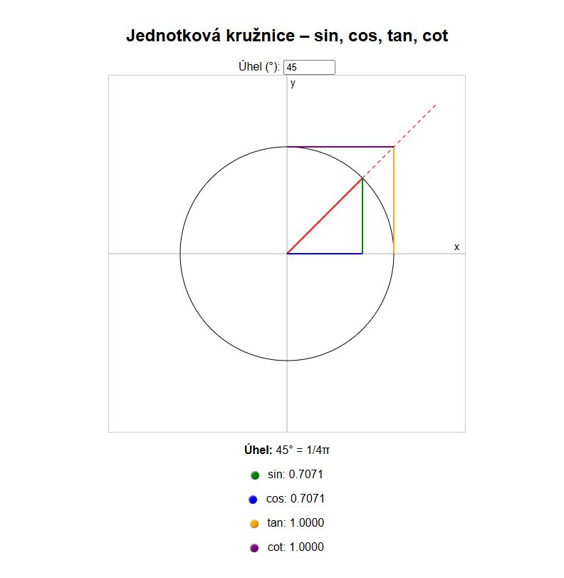

# 🎯 SinCos – Interaktivní jednotková kružnice

Tento projekt je vizualizací goniometrických funkcí na jednotkové kružnici pomocí JavaScriptu a HTML5 `<canvas>`.

## 🌐 Vícejazyčná podpora / Multilingual support

- [🇬🇧 English](README.en.md)
- [🇨🇿 Čeština](README.md)

## 🔍 Co to umí

- Zobrazení **jednotkové kružnice** s osami X a Y
- Interaktivní ovládání **úhlu v rozsahu 0–360°**
- Vizualizace funkcí:
  - ✅ `sin(θ)` – zeleně
  - ✅ `cos(θ)` – modře
  - ✅ `tan(θ)` – oranžově (kolmice z osy X k úhlové přímce)
  - ✅ `cot(θ)` – fialově (kolmice z osy Y k úhlové přímce)
- Přesné **prodloužení úhlu přes kružnici** – včetně průsečíků
- Hodnoty funkcí zobrazené pod grafem včetně převodu úhlu na `π` (např. `π/4`)
- Barevné 3D **legendy** k jednotlivým funkcím

---

## ▶️ Jak to spustit

Stačí otevřít `index.html` v libovolném prohlížeči.  
Nebo si projekt nasadit přes GitHub Pages: `https://xnene.github.io/sincos/`

---

## 🛠️ Technologie

- HTML5 Canvas
- Čistý JavaScript (bez knihoven)
- CSS pro 3D efekty bodů v legendě

---

## 🎓 Ideální pro:

- Výuku trigonometrie na ZŠ / SŠ
- Matematické prezentace
- Sebe-vzdělávání nebo procvičování vizuální představivosti

---

## ✅ TODO / Nápady na vylepšení

- [ ] Checkboxy pro skrytí/zobrazení funkcí
- [ ] Animovaný průběh úhlu
- [ ] Zobrazení pravoúhlého trojúhelníku v kružnici
- [ ] Podpora mobilního rozhraní

---

## 🧠 Autor

[💡 Xnene](https://github.com/Xnene)

---

