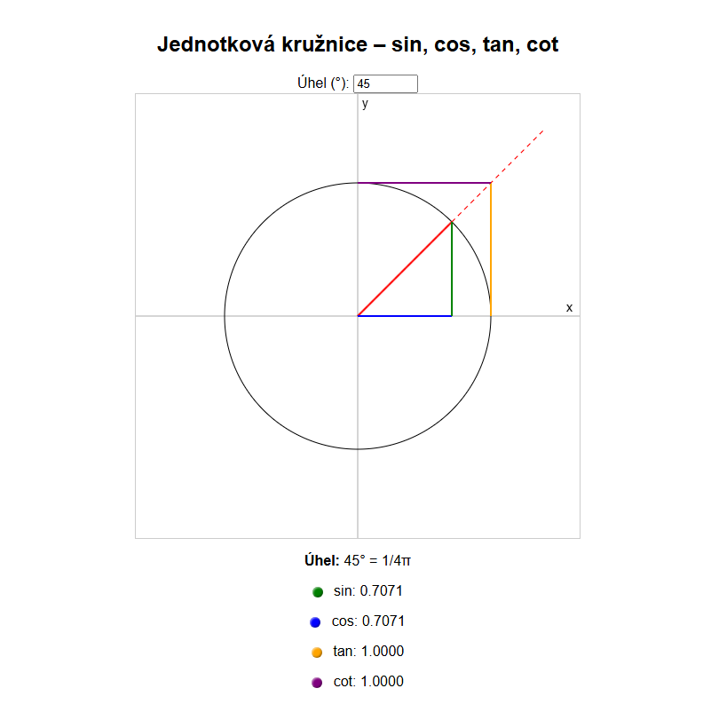

# 🎯 SinCos – Interactive Unit Circle Visualizer

This project visualizes trigonometric functions on the **unit circle** using HTML5 Canvas and JavaScript. It's designed for educational use in math classes or for self-study, with support for both **Czech** and **English**.

## 🌐  Multilingual support / Vícejazyčná podpora

- [🇬🇧 English](README.en.md)
- [🇨🇿 Čeština](README.md)



---


## 🔍 Features

- **Interactive unit circle** with X and Y axes
- Real-time angle control via input (0–360°)
- Visualization of trigonometric functions:
  - ✅ `sin(θ)` – green
  - ✅ `cos(θ)` – blue
  - ✅ `tan(θ)` – orange (vertical line from X-axis intersection)
  - ✅ `cot(θ)` – purple (horizontal line from Y-axis intersection)
- Extended **angle ray** beyond the circle to visualize intersections
- Displays function values with 3D-colored dots
- Converts angle into **π-form** (e.g., π/4)
- Supports **language switching** (CZ/EN)

---

## 🚀 How to Run

### ▶️ Option 1: Open locally
Just open the `index.html` file directly in your browser.

### 🌐 Option 2: View online
Visit the GitHub Pages version here:
```
https://xnene.github.io/sincos/
```

---

## 🛠️ Tech Stack

- ✅ HTML5 Canvas
- ✅ Vanilla JavaScript
- ✅ Dynamic language switching
- ✅ CSS for 3D visual effect dots

---

## 📂 File Structure

```
.
├── index.html         # Main interactive visualizer
├── README.md          # Czech version
├── README.en.md       # English version
└── preview.png        # Optional preview image
```

---

## 💡 Educational Use

Great for:
- High school trigonometry
- Math presentations
- Intuitive geometric understanding of `sin`, `cos`, `tan`, `cot`

---

## 🧠 Author

Developed by [Xnene](https://github.com/Xnene) as an open educational tool. Contributions welcome!